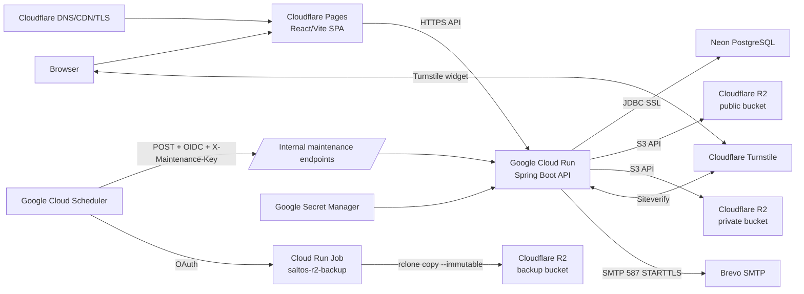
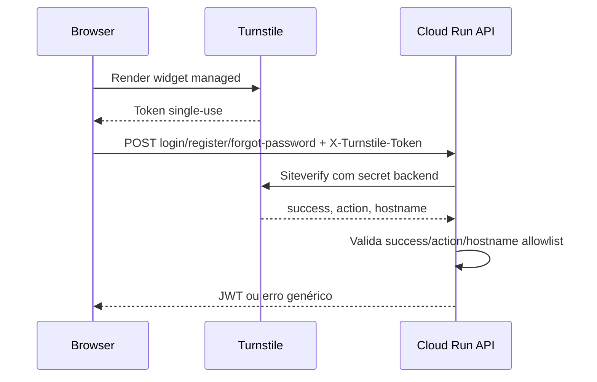
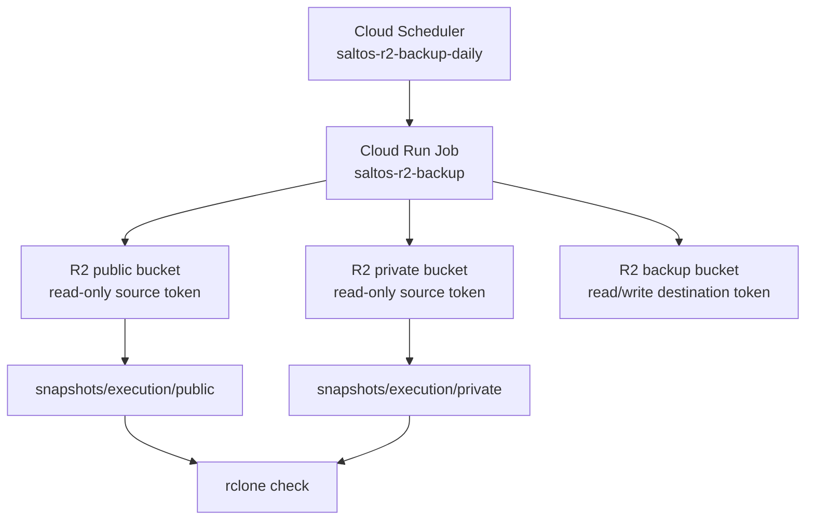
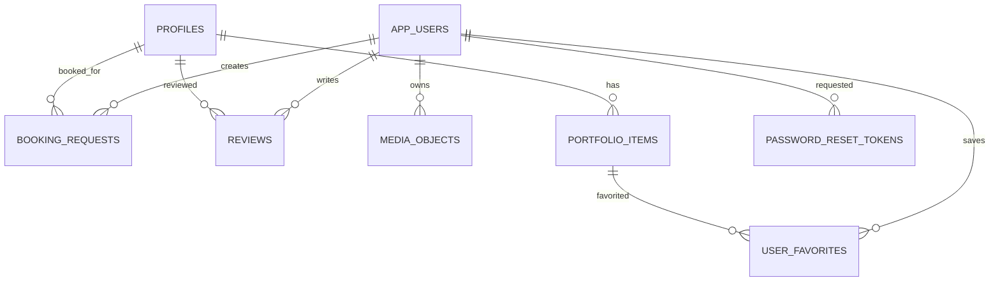

# Arquitetura

Last verified: 2026-09-20.

## Visão Geral



## Componentes

| Componente | Responsabilidade |
| --- | --- |
| Cloudflare Pages | Serve o frontend estático no domínio oficial a partir da production branch `main`. |
| Google Cloud Run | Executa a API Spring Boot stateless; 1 CPU, 1 GiB RAM, concurrency 80, max 2, scale-to-zero e startup CPU boost. |
| Neon PostgreSQL | Persistência relacional; produção usa SSL, Flyway até V22, PITR/history observado de 6 horas e snapshot manual pré-lançamento. |
| Cloudflare R2 | Armazena media runtime. Bucket público para media publicada; bucket privado para uploads pendentes/privados; bucket separado para backups. |
| Google Cloud Scheduler | Aciona maintenance endpoints e o Cloud Run Job de backup porque Cloud Run pode escalar para zero. |
| Google Secret Manager | Guarda secrets de produção para backend. |
| Cloudflare Turnstile | Protege fluxos públicos de autenticação contra bots. |
| Brevo | Email transacional ativo por SMTP 587 STARTTLS. |

`render.yaml` existe no repositório mas deve ser tratado como configuração histórica/alternativa, não como a arquitetura principal de produção.

## Fluxo Frontend/API

1. O browser carrega a SPA no Cloudflare Pages.
2. A SPA chama `VITE_API_URL`.
3. O backend responde por `/api/v1`.
4. Endpoints públicos incluem perfis, portfólio, materiais, contactos, reviews publicadas e media pública.
5. Endpoints privados usam JWT no header `Authorization`.
6. Endpoints admin exigem role `ADMIN`.

O frontend usa React Router com URLs reais como `/perfis/:slug`, `/agendar/:slug`, `/contactos`, `/materiais`, `/login`, `/reset-password`, `/conta`, `/favoritos` e `/admin/*`. Cloudflare Pages serve deep links através de `frontend/public/_redirects` com regras explícitas para as rotas conhecidas, sem catch-all genérico nem regras para `/api`.

A sessão guardada em `sessionStorage` é restaurada imediatamente no cliente para evitar bloquear conteúdo público. A validação `/auth/me` corre em background; rotas privadas e admin mostram apenas loading local até a sessão ser validada.

Produção pública atual: `https://www.saltosnaspalhacadas.pt`. O apex `saltosnaspalhacadas.pt` redireciona com 301 para `www` preservando query strings.

## Frontend Design System

O frontend usa Tailwind CSS v4 com integração oficial Vite (`@tailwindcss/vite`) como camada de build/utilitários, mantendo CSS Modules para componentes com comportamento próprio como crop, media cards, lightbox, suporte e admin.

Os valores de marca vivem em CSS variables globais em `frontend/src/index.css`: cores Saltos, superfícies, tipografia, espaçamento, sombras, radii, estados e transições. A tipografia é self-hosted via Fontsource Variable, com `Manrope` para UI/body e `Bricolage Grotesque` para headings/display, evitando pedidos externos de fontes e layout shift por Google Fonts.

O sistema visual evita frameworks UI monolíticos. Componentes e padrões inspirados em primitives modernas são implementados localmente e adaptados à identidade Saltos.

## Fluxo de Auth e Turnstile



Turnstile protege `login`, `register` e `forgot-password`; `reset-password` não usa Turnstile. O token não é guardado pelo backend.

## Conteúdo Inicial Estático

Os três perfis públicos iniciais continuam a ter metadata persistida em PostgreSQL
(`profiles` e `portfolio_items`), permitindo edição normal pelo painel admin.

A media inicial desses perfis é versionada em:

`frontend/public/content/profiles/`

e servida diretamente como assets estáticos pelo Cloudflare Pages.

Isto evita usar R2 para o conteúdo inicial já conhecido, mantendo R2 para uploads
posteriores feitos pelo admin e para media runtime.

O seed de metadata está em:

`ops/seed/default-content.sql`

Este ficheiro é um seed manual idempotente, não uma migration Flyway.
Não contém emails privados de notificações; esses valores são configurados
posteriormente através do painel admin.

Os endpoints públicos de perfis, portfolio e contactos usam cache HTTP pública curta
(`max-age=60`) para reduzir leituras repetidas desnecessárias. O frontend também deduplica pedidos em voo e mantém cache em memória para perfis/contactos, invalidada por eventos admin como `profiles:changed` e `contacts:changed`.

## Admin Content Management

O painel admin mantém as rotas `/admin/*`, mas organiza a gestão de conteúdo como backoffice dedicado:

- Perfis: criação/edição, crop/zoom da imagem, vídeo de destaque, links sociais extensíveis, email privado de notificações e ordenação da homepage.
- Portfolio: endpoint admin próprio para listar itens publicados e ocultos. A ordenação permanece cronológica por `eventDate DESC, id DESC`; não existe ordenação manual de portfolio.
- Materiais: criação, edição de nome/fotografia, eliminação e ordenação pública.
- Contactos: criação, edição, eliminação, ordenação, ocultar/mostrar; endpoints públicos continuam a devolver apenas contactos visíveis.

Não foi necessária nova migration para esta ronda porque a schema existente já inclui `portfolio_items.published`, `contacts.visible`, `materials.display_order`, `profiles.active` e `profile_social_links`.

Uploads públicos de admin podem ser reutilizados por várias entidades e não têm ownership próprio em `media_objects`; por isso, o sistema não faz cleanup automático de R2/public media ao editar ou apagar conteúdo. Essa limpeza fica como follow-up com tracking explícito de ownership/referências.

## Fluxo de Media

```mermaid
flowchart TD
  Upload[Upload multipart] --> Validate[MediaFileValidator\nMIME + magic bytes + tamanho]
  Validate --> Private[R2 private bucket]
  Private --> DB[(media_objects)]
  DB --> Review[Moderação/associação]
  Review -->|aprovar/publicar| Copy[CopyObject private -> public\nmetadataDirective COPY]
  Copy --> Public[R2 public bucket]
  Copy --> Delete[DeleteObject private]
  Public --> API[/GET /api/v1/media/{key}/]
  Private --> PrivateAPI[/GET /api/v1/private-media/{key}/]
```

Validação lê apenas os primeiros bytes necessários para magic bytes; o upload R2 usa stream novo desde o início. Limites atuais: imagens 10 MiB, vídeos 30 MiB, multipart file 30 MB e request 31 MB.

## Fluxo de Jobs

Em dev/test, os métodos `@Scheduled` continuam ativos por configuração. Em prod, `application-prod.properties` define os dois cron expressions como `-`, forma suportada pelo Spring para desativar cron scheduled.

Em produção:

- Cloud Scheduler chama `POST /internal/maintenance/private-media-cleanup` todos os dias às 03:30 Europe/Lisbon.
- Cloud Scheduler chama `POST /internal/maintenance/booking-reminders` todos os dias às 09:00 Europe/Lisbon.
- Ambos usam OIDC, service account dedicado e header `X-Maintenance-Key`.
- O controller valida a chave em comparação resistente a timing attacks antes de executar qualquer serviço.
- Cloud Scheduler também invoca o Cloud Run Job `saltos-r2-backup` às 02:30 Europe/Lisbon, antes do cleanup privado.

Os dois maintenance endpoints e o Scheduler do backup R2 foram executados manualmente com sucesso. O backup R2 também foi validado via trigger do Scheduler.

## Fluxo de Email

- `EmailService` continua a enviar plain text via Brevo SMTP.
- `BookingNotificationService` preserva emails de cliente e, na Feature 4 em `feat/notifications-and-email`, adiciona notificações operacionais para o email privado do artista e para admins ativos.
- `SiteNotificationService` carrega admins ativos da DB (`ADMIN` + `active=true`), deduplica destinatários case-insensitively e ignora duplicados entre artista/admin.
- `profiles.notification_email` é privado e usado apenas para notificações relacionadas com o artista; não entra em DTOs públicos, perfil público, portfólio ou frontend público.
- Falhas de envio são best-effort e não devem reverter bookings, registos ou reviews.

## Fluxo de Backup R2



O job usa `rclone copy`, não `sync`, com `--immutable`, e executa `rclone check` depois das cópias. O bucket `saltos-prod-backup` usa bucket lock de 30 dias para `snapshots/` e lifecycle de delete após 35 dias. Os buckets runtime não têm estas regras porque a aplicação precisa de apagar e mover objetos.

## Modelo Lógico de Dados



## Migrations Flyway

| Versão | Objetivo |
| --- | --- |
| V1 | Cria `profiles` e `portfolio_items`, incluindo tipo PHOTO/VIDEO e índices públicos. |
| V2 | Cria `app_users` com roles `ADMIN`/`CUSTOMER` e password hash. |
| V3 | Cria `contacts` com tipos EMAIL/PHONE/WHATSAPP/INSTAGRAM/WEBSITE. |
| V4 | Adiciona posição de imagem aos perfis. |
| V5 | Cria favoritos de utilizador sobre itens de portfólio. |
| V6 | Cria pedidos de booking com estado, orçamento e contraproposta. |
| V7 | Adiciona vídeo de destaque a perfis e cria reviews. |
| V8 | Liga reviews a perfis e utilizadores. |
| V9 | Adiciona zoom/crop de perfil e dados de conta do utilizador. |
| V10 | Adiciona crop de avatar de utilizador e índice de reviews por data. |
| V11 | Enriquece bookings com local, contacto, horas, casamento, custom event e cancelamento. |
| V12 | Cria partilhas de clientes. |
| V13 | Torna legenda das partilhas obrigatória. |
| V14 | Adiciona `reminder_sent_at` e índice de lembretes de bookings. |
| V15 | Cria materiais. |
| V16 | Adiciona ordenação de perfis. |
| V17 | Cria `media_objects` e liga partilhas a media gerida e consentimento público. |
| V18 | Migration Java: adiciona purpose de media, avatar gerido em `app_users` e ajusta FK owner. |
| V19 | Cria tokens de reset de password e `deleted_at` em utilizadores. |
| V20 | Remove a feature de partilhas de clientes, dropa `client_content_posts` e restringe `media_objects.purpose` a `PROFILE_AVATAR`. |
| V21 | Adiciona `profiles.notification_email` nullable, privada, `VARCHAR(254)`. |
| V22 | Cria `profile_social_links` com `platform` extensível por string, links ativos e `display_order`. |
