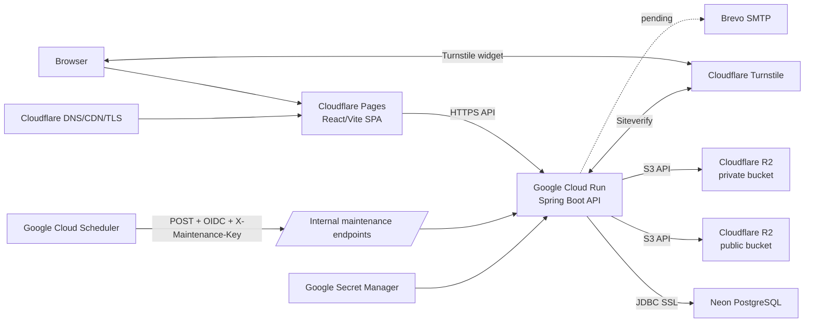
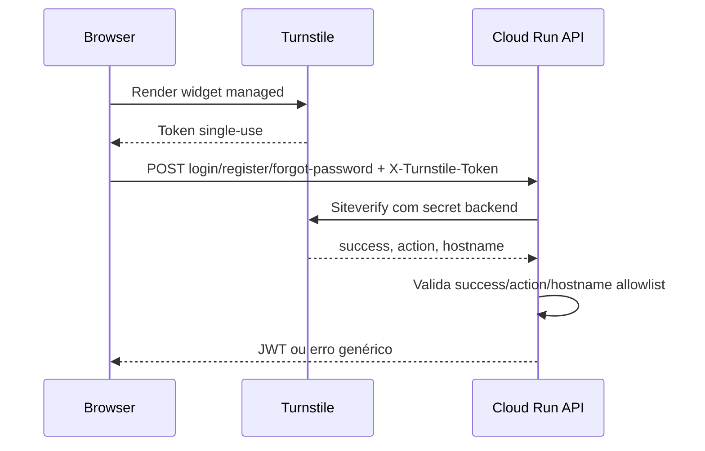
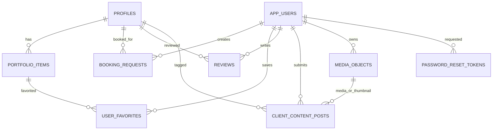

# Arquitetura

Last verified: 2026-09-15.

## Visão Geral



## Componentes

| Componente | Responsabilidade |
| --- | --- |
| Cloudflare Pages | Serve o frontend estático, `_headers`, `robots.txt`, `sitemap.xml`, `404.html` e assets Vite. |
| Google Cloud Run | Executa a API Spring Boot stateless; `min instances=0`, `max instances=2`, CPU 1, memória 1 GiB. |
| Neon PostgreSQL | Persistência relacional; produção usa SSL e Flyway até V19. |
| Cloudflare R2 | Armazena media. Bucket público para media publicada; bucket privado para uploads pendentes/privados. |
| Google Cloud Scheduler | Aciona tarefas em produção porque Cloud Run pode escalar para zero. |
| Google Secret Manager | Guarda secrets de produção para backend. |
| Cloudflare Turnstile | Protege fluxos públicos de autenticação contra bots. |
| Brevo | Email transacional planeado; ainda em progresso. |

`render.yaml` existe no repositório mas deve ser tratado como configuração histórica/alternativa, não como a arquitetura principal de produção.

## Fluxo Frontend/API

1. O browser carrega a SPA no Cloudflare Pages.
2. A SPA chama `VITE_API_URL`.
3. O backend responde por `/api/v1`.
4. Endpoints públicos incluem perfis, portfólio, materiais, contactos, reviews publicadas, partilhas aprovadas e media pública.
5. Endpoints privados usam JWT no header `Authorization`.
6. Endpoints admin exigem role `ADMIN`.

O frontend atual usa navegação por estado interno em `App.tsx`, não rotas públicas reais por perfil. O sitemap lista essencialmente a homepage; SEO por animador requer rotas futuras como `/animadores/kidg`.

## Fluxo de Auth e Turnstile



Turnstile protege `login`, `register` e `forgot-password`; `reset-password` não usa Turnstile. O token não é guardado pelo backend.

## Fluxo de Media

```mermaid
flowchart TD
  Upload[Upload multipart] --> Validate[MediaFileValidator\nMIME + magic bytes + tamanho]
  Validate --> Private[R2 private bucket]
  Private --> DB[(media_objects)]
  DB --> Review[Moderação/associação]
  Review -->|aprovar/publicar| Copy[CopyObject private -> public\nmetadataDirective COPY]
  Copy --> Public[R2 public bucket]
  Copy --> Delete[DeleteObject private]
  Public --> API[/GET /api/v1/media/{key}/]
  Private --> PrivateAPI[/GET /api/v1/private-media/{key}/]
```

Validação lê apenas os primeiros bytes necessários para magic bytes; o upload R2 usa stream novo desde o início. Limites atuais: imagens 10 MiB, vídeos 30 MiB, multipart file 30 MB e request 31 MB.

## Fluxo de Jobs

Em dev/test, os métodos `@Scheduled` continuam ativos por configuração. Em prod, `application-prod.properties` define os dois cron expressions como `-`, forma suportada pelo Spring para desativar cron scheduled.

Em produção:

- Cloud Scheduler chama `POST /internal/maintenance/private-media-cleanup`.
- O request usa OIDC e header `X-Maintenance-Key`.
- O controller valida a chave em comparação resistente a timing attacks.
- Só depois executa o serviço.

O endpoint `POST /internal/maintenance/booking-reminders` existe, mas o Scheduler respetivo ainda não deve ser criado enquanto SMTP real não estiver ativo e validado.

## Modelo Lógico de Dados



## Migrations Flyway

| Versão | Objetivo |
| --- | --- |
| V1 | Cria `profiles` e `portfolio_items`, incluindo tipo PHOTO/VIDEO e índices públicos. |
| V2 | Cria `app_users` com roles `ADMIN`/`CUSTOMER` e password hash. |
| V3 | Cria `contacts` com tipos EMAIL/PHONE/WHATSAPP/INSTAGRAM/WEBSITE. |
| V4 | Adiciona posição de imagem aos perfis. |
| V5 | Cria favoritos de utilizador sobre itens de portfólio. |
| V6 | Cria pedidos de booking com estado, orçamento e contraproposta. |
| V7 | Adiciona vídeo de destaque a perfis e cria reviews. |
| V8 | Liga reviews a perfis e utilizadores. |
| V9 | Adiciona zoom/crop de perfil e dados de conta do utilizador. |
| V10 | Adiciona crop de avatar de utilizador e índice de reviews por data. |
| V11 | Enriquece bookings com local, contacto, horas, casamento, custom event e cancelamento. |
| V12 | Cria partilhas de clientes. |
| V13 | Torna legenda das partilhas obrigatória. |
| V14 | Adiciona `reminder_sent_at` e índice de lembretes de bookings. |
| V15 | Cria materiais. |
| V16 | Adiciona ordenação de perfis. |
| V17 | Cria `media_objects` e liga partilhas a media gerida e consentimento público. |
| V18 | Migration Java: adiciona purpose de media, avatar gerido em `app_users` e ajusta FK owner. |
| V19 | Cria tokens de reset de password e `deleted_at` em utilizadores. |
