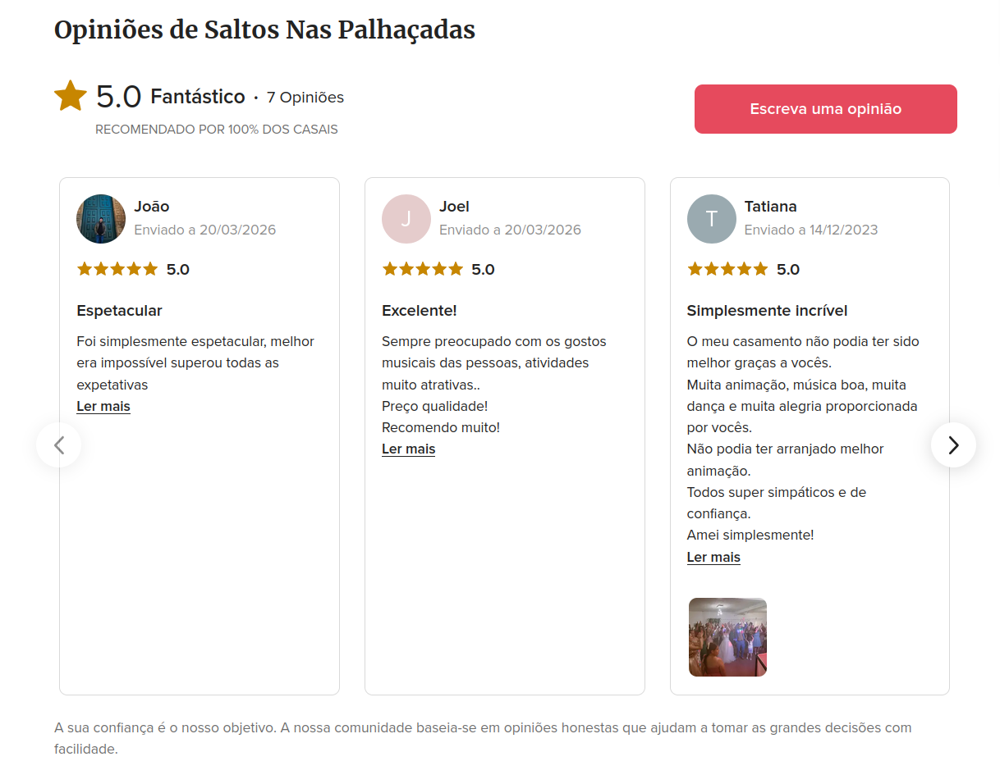

- falta a parte do agendamento
- deploy online do site
- fix alteraçao da foto de perfil, descubri esse bug
- fix da posiçao dos perfis, 3 perfis por linha 
-registo tem de conter o numr telemovell

- conteudos apareceram do mais recente para o mais velho (mais velho em baixo)

- motor de pesquisa, ao procurar por Dj kidg ou dj joao tomas se me leva ao site logo

- apos o login do user, dizer na home page Bem vindo @user

- comentarios/reviews/avaliaçoes, controlado pelo o admin, essa secçao deve ser debaixo dos  perfis da homepage
cada comentario pode deixar uma avaliaçao de 1-5 estrelas

(ideia dos casamentos.pt)

- traduçao da pagina

- video de destaque a passar quando abre o perfil de cada artista (editavel pelo o admin)

//
o agendamento funciona desta forma

o user ve o calendario e manda um pedido de orçamento e agendamento, com o tipo de evento, local, nome, contacto email e telemovel, descriçao do evento, eventuais notas, horas (opcional)
na opçao de escolha de casamento preencher com os nomes dos noivos
na opçao outro, aparecer um campo para escrever 
em cada evento, ao selecionar o tipo de evento, aparece uma opçao lista de materiais e tudo que o animador tem de prestar como maquina de fumo, luzes
mudar para descriçao do evento/ serviços pretendidos

o animador recebe a proposta e manda uma proposta de orçamento por telemovel/email (dentro do site so quero que mostre as informaçoes todas ao animador, o contacto sera pessoal e fora do site)
depois confirma, altera ou rejeita o evento, mas entretanto o evento aparece no calendario como Em stand by. apos confirmar a data, fica marcada no calendario como data já indisponivel (pode acontecer haver um evento por exemplo para o mesmo dia das 10 da manha as 12 da manha e depois pode haver outro  evento no mesmo dia as 18 da noite ate as 19 da noite e isso dá para fazer, pode ser aceite ou nao pelo o animador)
o evento pode ser cancelado pelo o animador com uma mensagem de justificaçao

so pode mandar proposta quem tem login
quero que o user receba um email de confirmaçao que o animador recebeu a proposta e vai analisar o pedido e entrar em contacto
